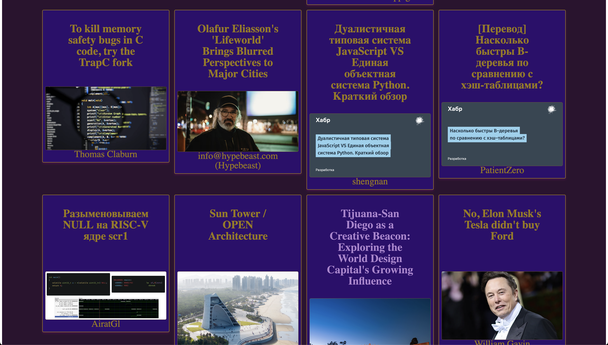

# News App

## Summary

Hello, and welcome to my news app, an app that pulls from a foreign api in order to aggregate them all into one easy-to-browse package! I currently consume the API of [NewsAPI](https://newsapi.org), which allows us to take in article data, including but not limited to headlines, authors, and article images. 

## Installation

To set up: clone this repo into new directory on local device.

Install Dependencies: Run the following command to install all necessary dependencies before you go any farther.
- run `npm install`

Start the application locally and open it in your browser. It's that simple! 
- run `npm start`

## Preview

## Contributors
- O'leary, Ryan
  - [Github](https://github.com/ROlearyPro)
  - [LinkedIn](https://www.linkedin.com/in/ryan-o-leary-6a963b211/)

## Tech Stack

- React version: 18.3.1
